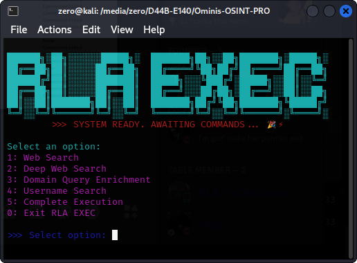

### RLA-EXEC Multi Tool v1.0
> REPLACEMENT FOR OMINIS-OSINT ...
**MAKE YOUR OSINT LIFE EASIER - THE FORGER IS FORMING A BETTER OMINIS-OSINT, THROUGH UPDATES THIS TOOL WILL HAVE EVERYTHING OMINIS-OSINT HAS AND MORE!**

## Overview:

__RLA EXEC simplifies the execution of multiple OSINT scripts by providing:__
- **A menu-driven interface** with color-coded options for easy navigation.
- **An animated startup banner** that adapts to your operating system, making the tool engaging and professional.
- **Support for multiple OSINT modules**, including web search, deep web search, domain query enrichment, and username search.
- **Complete execution mode** to run all scripts sequentially with a single command.
- **Automated output capture** where results can be stored in a designated folder for later review.
- **Interactive file configuration** to update search parameters and other settings without manual file editing.

>> **FEATURES:**
### Interactive Command-Line Interface
- **User-Friendly Menu:**  
  Navigate through the options with a color-coded, easy-to-read menu.
- **Animated Banner:**  
  Enjoy an animated startup display that sets the tone for a professional tool.

### Modular OSINT Scripts
- **Web Search (`search.py`):**  
  Launch standard web searches with customizable parameters.
- **Deep Web Search (`backrooms.py`):**  
  Explore the deep web with optional proxy support.
- **Domain Query Enrichment (`domainbox.py`):**  
  Retrieve detailed metadata such as page titles, descriptions, HTTP headers, IP addresses, ASN, and organizational information.
- **Username Search (`userdash.py`):**  
  Search for username-related information across various platforms.

### Complete Execution Mode
- **Run All Scripts:**  
  Execute all available scripts in sequence with one command, while interactive prompts help update configurations.
- **Output Capturing:**  
  By setting the output file flag to `True`, the tool automatically saves the results in a `RESULTS` folder.

### Dynamic Configuration and Updates
- **Interactive File Updates:**  
  Update files like `query.txt`, `country.txt`, `language.txt`, and `date_range.txt` via guided prompts.
- **Flexible Input Handling:**  
  The tool supports default values and interactive queries, making it easy for beginners to use without prior knowledge.

### Robust Error Handling and Graceful Shutdown
- **Error Reporting:**  
  Detailed error messages help you troubleshoot issues with script execution.
- **Graceful Exit:**  
  A signal handler ensures the tool shuts down safely (even on CTRL+C), preventing data loss or corruption.

# REQUIREMENTS:
- **Python 3.x** installed.
- Required Python packages:
  - `colorama`
  - `fake-useragent`
  - `requests`
  - `beautifulsoup4`
- Standard libraries such as `subprocess`, `multiprocessing`, `signal`, `os`, etc.

# RUN OPTIONS:

- ``bash exec.bash``
- ``python3 exec.py``
