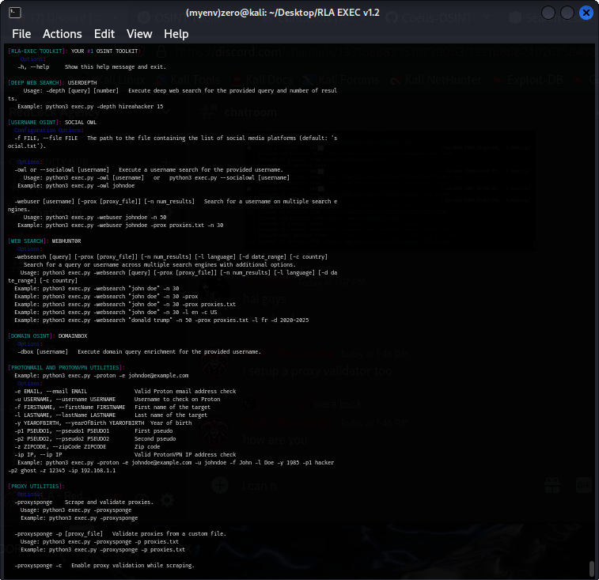

### EXEC TOOLKIT v1.2
> REPLACEMENT FOR OMINIS-OSINT ...
**MAKE YOUR OSINT LIFE EASIER - THE FORGER IS FORMING A BETTER OMINIS-OSINT, THROUGH UPDATES THIS TOOL WILL HAVE EVERYTHING OMINIS-OSINT HAS AND MORE!**

## IN-DEVELOPMENT UPDATE: v1.3
- **SQLI VULN SCANNER**

## COMMING-NEXT: 
- **XSS VULN SCANNERS** > v1.4
- **INPUT MENU OPTION** > v1.5
- **GUI OPTIONS** > v1.6
- **WEB UI** > v1.7



# RUN OPTIONS:

- ``pip install -r requirements.txt --break-system-packages && cd EXEC-TOOLKIT``
- ``python3 exec.py -h``

### > **EXEC TOOLKIT ARG VERSION DISPLAY:**
 
```
████████████████████████████████████████████████████████████████
█▌▄▄▄ .▐▄• ▄ ▄▄▄ . ▄▄·     ▄▄▄▄▄            ▄▄▌  ▄ •▄ ▪  ▄▄▄▄▄▐█
█▌▀▄.▀· █▌█▌▪▀▄.▀·▐█ ▌▪    •██  ▪     ▪     ██•  █▌▄▌▪██ •██  ▐█
█▌▐▀▀▪▄ ·██· ▐▀▀▪▄██ ▄▄     ▐█.▪ ▄█▀▄  ▄█▀▄ ██▪  ▐▀▀▄·▐█· ▐█.▪▐█
█▌▐█▄▄▌▪▐█·█▌▐█▄▄▌▐███▌     ▐█▌·▐█▌.▐▌▐█▌.▐▌▐█▌▐▌▐█.█▌▐█▌ ▐█▌·▐█
█▌ ▀▀▀ •▀▀ ▀▀ ▀▀▀ ·▀▀▀      ▀▀▀  ▀█▄▀▪ ▀█▄▀▪.▀▀▀ ·▀  ▀▀▀▀ ▀▀▀ ▐█
████████████████████████████████████████████████████████████████
________________________________________________________________
          >>> SYSTEM READY. AWAITING COMMANDS... 🎉⚡

[RLA-EXEC TOOLKIT]: YOUR #1 OSINT TOOLKIT!  
    Options:
   -h, --help     Show this help message and exit.
    
[DEEP WEB SEARCH]: USERDEPTH
     Usage: -depth [query] [number]   Execute deep web search for the provided query and number of results.
   Example: python3 exec.py -depth hireahacker 15
    
[USERNAME OSINT]: SOCIAL OWL
  Configuration Options:
  -f FILE, --file FILE   The path to the file containing the list of social media platforms (default: 'social.txt').
   
   Options:
  -owl or --socialowl [username] --pdf  Execute a username search for the provided username.
     Usage: python3 exec.py -owl [username]   or   python3 exec.py --socialowl [username]
   Example: python3 exec.py -owl johndoe --pdf

  -webuser [username] [-prox [proxy_file]] [-n num_results]   Search for a username on multiple search engines.
     Usage: python3 exec.py -webuser johndoe -n 50
   Example: python3 exec.py -webuser johndoe -prox proxies.txt -n 30

[WEB SEARCH]: WEBHUNT0R
   Options:
  -websearch [query] [-prox [proxy_file]] [-n num_results] [-l language] [-d date_range] [-c country]   
     Search for a query or username across multiple search engines with additional options.
    Usage: python3 exec.py -websearch [query] [-prox [proxy_file]] [-n num_results] [-l language] [-d date_range] [-c country]
  Example: python3 exec.py -websearch "john doe" -n 30
  Example: python3 exec.py -websearch "john doe" -n 30 -prox
  Example: python3 exec.py -websearch "john doe" -n 30 -prox proxies.txt
  Example: python3 exec.py -websearch "john doe" -n 30 -l en -c US
  Example: python3 exec.py -websearch "donald trump" -n 50 -prox proxies.txt -l fr -d 2020-2025

[DOMAIN OSINT]: DOMAINBOX & WEBDIVER
   Options:
   -dbox [username]   Execute domain query enrichment for the provided username.
   
   -webdiver [url]    Execute website crawling for the provided URL. Use --output to specify the directory to save results.
     Usage: python3 exec.py -webdiver [url] --output [directory]
   Example: python3 exec.py -webdiver https://example.com --output /path/to/save/results

[PROTONMAIL AND PROTONVPN UTILITIES]:
  Example: python3 exec.py -proton -e johndoe@example.com
   Options:
  -e EMAIL, --email EMAIL               Valid Proton email address check
  -u USERNAME, --username USERNAME      Username to check on Proton
  -f FIRSTNAME, --firstName FIRSTNAME   First name of the target
  -l LASTNAME, --lastName LASTNAME      Last name of the target
  -y YEAROFBIRTH, --yearOfBirth YEAROFBIRTH  Year of birth
  -p1 PSEUDO1, --pseudo1 PSEUDO1        First pseudo
  -p2 PSEUDO2, --pseudo2 PSEUDO2        Second pseudo
  -z ZIPCODE, --zipCode ZIPCODE         Zip code
  -ip IP, --ip IP                       Valid ProtonVPN IP address check
   Example: python3 exec.py -proton -e johndoe@example.com -u johndoe -f John -l Doe -y 1985 -p1 hacker -p2 ghost -z 12345 -ip 192.168.1.1

[PROXY UTILITIES]: SPROXYSPONGE
   Options:
  -proxysponge    Scrape and validate proxies.
    Usage: python3 exec.py -proxysponge
    Example: python3 exec.py -proxysponge

  -proxysponge -p [proxy_file]   Validate proxies from a custom file.
    Usage: python3 exec.py -proxysponge -p proxies.txt
    Example: python3 exec.py -proxysponge -p proxies.txt

  -proxysponge -c   Enable proxy validation while scraping.
    Usage: python3 exec.py -proxysponge -c
    Example: python3 exec.py -proxysponge -c

```
    
